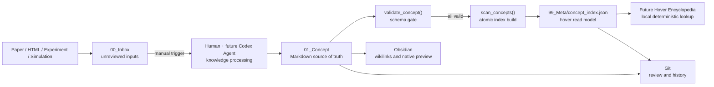

# Personal Research OS v0.1 Architecture

## 1. 目标与边界

v0.1 的唯一目标是建立可审计、可验证、可扩展的 Concept Database，并为 Hover Encyclopedia 提供最小稳定数据面。系统由文件构成，不依赖常驻服务：Markdown 是知识事实源，JSON 是可重新生成的快速读取索引，Git 是变更历史。

明确不在本阶段实现：RAG、embedding、向量数据库、AI 实时查询、自动爬虫、定时扫描、Obsidian 自定义插件和复杂工作流编排。

## 2. 逻辑架构



AI 只位于人工触发的知识处理环节。Hover 的运行路径是 `term → local index → Markdown note`，不包含模型调用。

## 3. 物理结构与职责

| 路径 | 状态 | 职责 |
| --- | --- | --- |
| `ResearchOS/00_Inbox` | 未审阅 | 保存待处理输入，不自动晋升为知识 |
| `ResearchOS/01_Concept` | 已审阅 | 保存可复用的稳定概念；唯一 Concept 事实源 |
| `ResearchOS/02_Project` | 已审阅 | 连接目标、阶段、决策与相关知识节点 |
| `ResearchOS/03_Paper` | 已审阅 | 保存论文级元数据、摘要和批判性阅读 |
| `ResearchOS/04_Experiment` | 已审阅 | 保存实验或仿真的输入、环境、运行与结果 |
| `ResearchOS/05_Tool` | 已审阅 | 保存软件版本相关操作和可复用流程 |
| `ResearchOS/99_Meta` | 系统 | 保存 Schema、模板、派生索引和维护工具 |

## 4. Concept 数据契约

一个 Concept 有三类身份：

- 稳定身份：YAML `id`，全库唯一，采用 lowercase `snake_case`。
- 规范名称：文件名与 H1，二者必须完全相同。
- 查询名称：规范名称加 `aliases`；扫描时按去除多余空白并 `casefold` 后检查全库冲突。

YAML 必填字段为 `id`、`aliases`、`category`、`level`、`confidence`、`origin`、`created` 和 `updated`。正文必须按 Schema 顺序包含 Hover Summary、Definition、My Understanding、Engineering View、Formula、Application、Related Concepts、Sources、Decision Log 和 History。

`Hover Summary` 是面向读取路径的反规范化字段：单段、最多 280 字符、无需打开全文即可理解。`Related Concepts` 使用 Obsidian wikilink；v0.1 不另建图数据库。

完整约束以 `ResearchOS/99_Meta/Concept_Schema_v0.1.md` 为准。

## 5. 索引构建与失败语义

`scan_concepts()` 递归扫描 `01_Concept/**/*.md`，执行以下步骤：

1. 以 UTF-8 读取 Markdown，并解析受控的 YAML 子集。
2. 校验元数据类型、枚举、日期、文件名/H1 和必填正文区块。
3. 在全库检查重复 `id`，以及规范名称/别名冲突。
4. 按规范名称确定性排序，生成 Vault 相对 POSIX 路径。
5. 先写临时文件，再原子替换 `concept_index.json`。

任一文件失败时，命令返回非零状态，不替换旧索引。这保证 Hover 消费者不会读到只包含部分 Concept 的索引。JSON 可以随时由 Markdown 重建，因此不得把 JSON 当作知识事实源。

## 6. Git 与人工审阅

推荐的变更单元是“一组相关 Concept 修改 + 同步生成的索引”。提交前至少运行：

```powershell
python ResearchOS/99_Meta/tools/concept_tools.py validate
python ResearchOS/99_Meta/tools/concept_tools.py scan
git diff --check
git diff
```

Git 记录谁在何时接受了哪次知识变更；`Decision Log` 记录为什么接受某个科研判断。二者互补，不能用自动生成的摘要替代人工确认。

## 7. 扩展点

- Phase 2 可以增加 Paper Schema 和显式的 Inbox → Paper → Concept 提案流程，不改变 Concept 读取契约。
- Phase 3 可以增加 HTML Collector，但采集结果仍先进入 Inbox，且必须人工触发处理。
- Phase 4 可以实现 Obsidian Hover 插件；插件只读取 `concept_index.json` 和 Concept Markdown。
- 只有在 Concept 数量或查询需求证明 JSON 不足后，才评估全文索引或其他存储；v0.1 不预设向量层。
- 若 YAML 需要多行标量、锚点或深层结构，应引入经过评审的 YAML 库并升级 Schema 版本，而不是继续扩张当前的小型解析器。

## 8. v0.1 验收条件

- 七个标准 Vault 顶层目录存在并可被 Git 跟踪。
- Concept Schema v0.1 和可复制模板存在。
- `HOM impedance`、`Wakefield`、`Q factor`、`S parameter`、`CST wakefield solver` 五个样例通过校验。
- `concept_index.json` 可由脚本确定性重建，且包含五个规范名称。
- README 说明结构、工作流、命令和 Codex Agent 接入边界。
- 仓库不包含 RAG、向量数据库、实时 AI 查询或自动爬虫实现。
